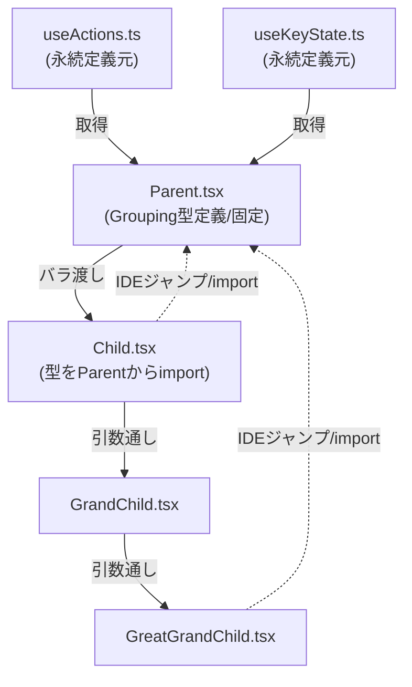

# [Workflow-006] 型定義の配置・整理ルール (Type Definitions Placement)

## 概要

型定義の配置場所と、コンポーネント間での受け渡しに関するプロジェクトの Source of Truth（唯一の正解）です。

## 配置の絶対原則 (Absolute Principles)

1.  **定義場所の固定 (Invariant Location)**: 型定義は生成元（Hook）や再合成ハブ（親/Main コンポーネント）で定義し、下流へ移動させません。
2.  **Parent -> Child (One-way Data Flow)**: 型は常に親から子へ流れます。下流で定義した型を上流が import する「逆流」は禁止です。
3.  **IDE 追跡性の確保**: 定義場所を固定することで、IDE の「参照元検索」機能により、定義から利用箇所を即座に特定できる状態を維持します。

## 階層別配置マニュアル & コード例

| 階層 / 状況         | 推奨される配置場所（定義場所） | 理由・アクション                                                                                                                                                                          |
| :------------------ | :----------------------------- | :---------------------------------------------------------------------------------------------------------------------------------------------------------------------------------------- |
| **1. Hook 定義**    | `useXxx.ts`                    | **`useXxxReturn` 型を定義・export** する。以後、ここを永続的な定義場所とする。                                                                                                            |
| **2. 分解・再合成** | `Parent.tsx`                   | Hook から値を取り出し、**ここで Grouping 型 (`CombinedControl`) を定義・export** する。その際、型定義は永続的な定義場所からインポートした型を組み合わせたものとし、自前で型定義はしない。 |
| **3. ハブ (利用)**  | `Child.tsx`                    | 定義場所 (`Parent`) から Grouping 型を import して利用する。**自前で型定義はしない。**                                                                                                    |
| **4. 下流利用**     | `GrandChild` 以降              | さらに上流 (`Parent` または `Child` の中継) から型を import して利用する。                                                                                                                |

```ts
// 1. useActions.ts / useKeyState.ts (永続的な定義場所)
export type useActionsReturn = { add: () => void };
export type useKeyStateReturn = { isPressed: boolean };

// 2. Parent.tsx (中継)
import { useActions } from "./useActions";
import { useKeyState } from "./useKeyState";

export interface CombinedControl {
  add: useActionsReturn["add"];
} & Pick<useKeyStateReturn, "isPressed">;

export const Parent = () => {
  const { add } = useActions();
  const { isPressed } = useKeyState();
  // Grouping: 型整合性を担保するため、一度オブジェクトとして合成する（実引数としてはバラで渡してもよい）
  const control: CombinedControl = { add, isPressed };

  return <Child add={add} isPressed={isPressed} />;
};

// 3. Child.tsx (定義場所: 再合成)
import type { CombinedControl } from "./Parent";

// 定義元の型を Pick 等で加工して追従性を維持する

export const Child = ({ add, isPressed }: CombinedControl) => {
  // 再合成せず、そのまま必要なプロパティを下流へ渡す
  return <GrandChild add={add} isPressed={isPressed} />;
};

// 4. GrandChild.tsx (利用のみ)
import type { CombinedControl } from "./Child";

export const GrandChild = ({ add, isPressed }: CombinedControl) => {
  /_ 利用に専念 _/;
};
```



## 検証プロトコル (Verification)

ファイルの移動やリネームが発生した場合は、以下の手順で整合性を確認してください。

1.  **実在確認**: `list_dir` を使用し、移動先のファイルが存在し、旧ファイルが削除されているか確認する。
2.  **参照確認**: `grep_search` で旧パスの文字列が残存していないか確認する。
3.  **型検査**: `npm run typecheck` を実行し、import パスの解決エラーがないか確認する。

## 知見の継続的改善 (Continuous Knowledge Improvement)

このワークフローを使用する中で、より効率的な配置パターンや例外ケースを発見した場合は、本ファイルの更新・改善を提案してください。

## 知見の種 (Seed) の記録

上記に加え、作業中に普遍的な知見を発見した場合は、直ちに `seeds.md` (Working Dir) へ記録してください。
