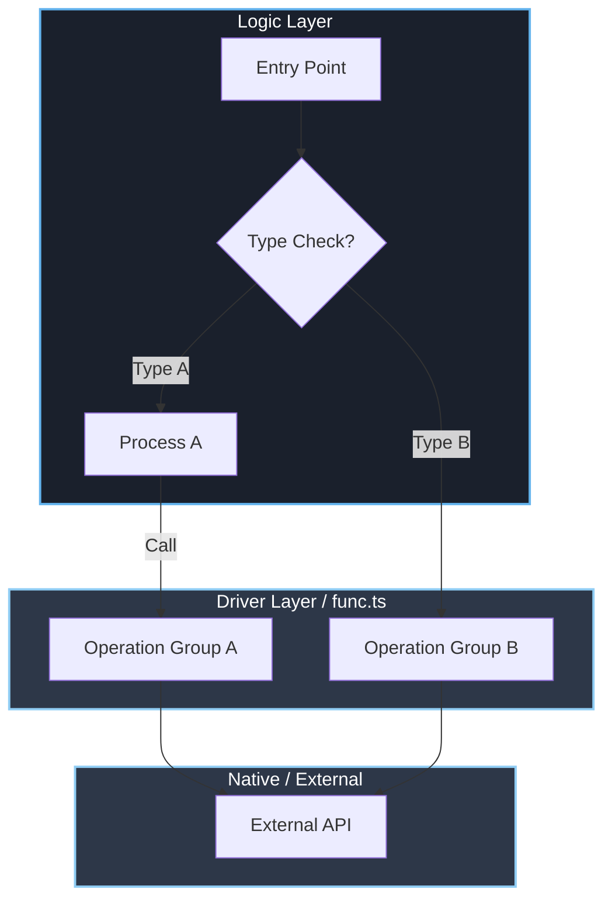

# [Workflow-012] Effective Architectural Visualization

## 概要

実装計画や設計書におけるアーキテクチャ図（Mermaid）の作成ガイドラインです。
誤解を招かない正確な表現と、どのような環境でも見やすい視認性を確保するための標準を定めます。

## 1. 基本原則: 脱・クラス図 (Flowchart over Class Diagram)

TypeScript や Go などのプロジェクトにおいて、単純なクラス継承構造ではない「モジュール」「関数群」「コンポーネント」の関係を示す場合は、**Class Diagram ではなく Flowchart を採用してください**。

- **Class Diagram の弊害**:
  - 実態が関数であるのに「クラス」として認識され、誤ったメンタルモデルを形成する。
  - `namespace` を使うとレンダリングエラーや参照の複雑化（ドット表記の強制）を招きやすい。
- **Flowchart の利点**:
  - 処理の流れ（Flow）と依存関係（Dependency）を直感的に表現できる。
  - `subgraph` を用いることで、ファイルやモジュールの境界を柔軟に表現できる。

## 2. 構成要素と描き方

### 2.1 責務の分離 (Separation of Concerns)

システムを以下のレイヤーに分解し、`subgraph` で視覚的に分離してください。

1.  **Logic / Controller**: 判断を下し、フローを制御する層（例: `ActionExecutor`）。
2.  **Driver / Adapter**: 外部 API やハードウェアを叩く層（例: `MouseSender`）。
3.  **Infrastructure / Native**: 実際の OS API やライブラリ（例: `Koffi`, `WinAPI`）。

### 2.2 ロジック分岐の明示

「マクロの場合」と「単発実行の場合」など、経路が異なる場合は省略せずに分岐を描いてください。

- ❌ `moveMouse`, `getCursorPos`, `sendInput`, `getKeyState`... (ノード過多)
- ⭕ `PositionOps` (move, getPos), `ButtonOps` (click, press)

## 3. 視認性とアクセシビリティ (Dark Mode Support)

黒背景（ダークモード）でも視認性を確保するため、**必ずスタイル定義を含めてください**。
デフォルトの配色はダークモードで非常に見づらいため、明示的な `style` 指定が必須です。

### 推奨スタイルテンプレート

```mermaid
%% Dark Mode Friendly Styles
style NodeName fill:#1a202c,stroke:#63b3ed,stroke-width:2px,color:#fff
style AnotherNode fill:#2d3748,stroke:#90cdf4,stroke-width:2px,color:#fff
```

- **Logic 層**: `fill:#1a202c` (濃い黒/紺), `stroke:#63b3ed` (明るい青)
- **Driver 層**: `fill:#2d3748` (グレー), `stroke:#90cdf4` (水色)

## 4. テンプレート (Copy & Paste Use)

以下のテンプレートをベースに作図を開始することを推奨します。


