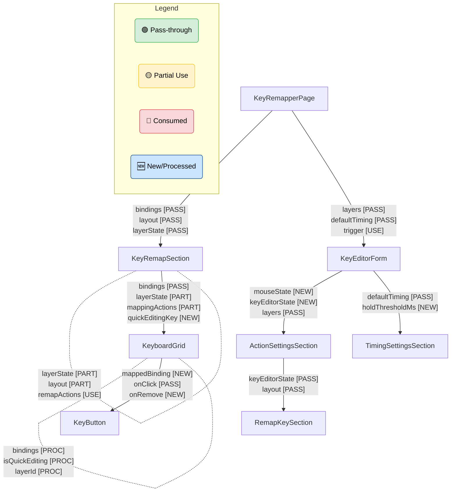

# プロップス伝播フロー詳細図

このドキュメントは、アプリケーション内でのデータフローとプロップスの伝播状況を詳細に可視化したものです。
親コンポーネントから子コンポーネントへ渡されるプロップスについて、**そのまま渡しているもの（Pass-through）**、**一部を使用して渡しているもの（Partial Use）**、**消費して終了するもの（Consumed）** を明確に区別しています。

## 記号の定義

- 🟢 **[PASS]**: 親から受け取った値をそのまま子へ渡す（Pass-through）
- 🟡 **[PART]**: 親から受け取ったオブジェクトの一部を使用し、オブジェクト自体または残りを子へ渡す
- 🔴 **[USE]**: コンポーネント内で使用・消費され、子へは渡されない
- 🆕 **[NEW]**: そのコンポーネントで新しく生成・定義されて子へ渡される
- 🔄 **[PROC]**: 受け取った値を加工して子へ渡す

## フロー詳細

### 1. Root -> KeyRemapperPage

`KeyRemapperPage` は状態管理のルートであり、Hooks からデータを取得して分配します。

### 2. KeyRemapperPage -> KeyRemapSection

`KeyRemapperPage` で生成された状態や関数が `KeyRemapSection` に渡されます。

| Props 名          | 状態          | 説明                                                    |
| :---------------- | :------------ | :------------------------------------------------------ |
| `bindings`        | 🟢 **[PASS]** | `useLayerState` から取得し、そのまま渡す                |
| `keyboardLayout`  | 🟢 **[PASS]** | state から計算し、そのまま渡す                          |
| `layerActions`    | 🟢 **[PASS]** | `useLayerState` の関数群をオブジェクト化して渡す        |
| `layerState`      | 🟢 **[PASS]** | `useLayerState` の状態をオブジェクト化して渡す          |
| `layout`          | 🟢 **[PASS]** | state をそのまま渡す                                    |
| `mappingActions`  | 🟢 **[PASS]** | `saveMapping`, `removeMapping` をオブジェクト化して渡す |
| `remapActions`    | 🟢 **[PASS]** | `useRemapControl` の関数群をオブジェクト化して渡す      |
| `selectedTrigger` | 🟢 **[PASS]** | state をそのまま渡す                                    |
| `onLayoutToggle`  | 🟢 **[PASS]** | ハンドラ関数を渡す                                      |
| `onTriggerChange` | 🟢 **[PASS]** | state setter を渡す                                     |
| `setEditingKey`   | 🟢 **[PASS]** | state setter を渡す                                     |

### 3. KeyRemapSection -> Children

`KeyRemapSection` は受け取ったプロップスを振り分けます。

**To KeyboardGrid:**
| Props 名 | 状態 | 説明 |
| :--- | :--- | :--- |
| `bindings` | 🟢 **[PASS]** | そのまま渡す |
| `keyboardLayout` | 🟡 **[PART]** | QuickRemap で使用しつつ、子へ渡す |
| `layout` | 🟡 **[PART]** | 表示に使用しつつ、子へ渡す |
| `layerState` | 🟡 **[PART]** | `layerId` を QuickRemap で使用しつつ、子へ渡す |
| `mappingActions` | 🟡 **[PART]** | `saveMapping` を QuickRemap で使用しつつ、子へ渡す |
| `selectedTrigger` | 🟡 **[PART]** | QuickRemap で使用しつつ、子へ渡す |
| `quickEditingKey` | 🆕 **[NEW]** | QuickRemap の状態として生成して渡す |
| `onKeyClick` | 🆕 **[NEW]** | `setEditingKey` (🔴) 等を使ってラップした関数を渡す |

**To LayerTabs:**
| Props 名 | 状態 | 説明 |
| :--- | :--- | :--- |
| `layerState` | 🟢 **[PASS]** | そのまま渡す |
| `layerActions` | 🟢 **[PASS]** | そのまま渡す |

**To Other Children (TriggerTabs, LayoutToggle, etc):**
| Props 名 | 状態 | 説明 |
| :--- | :--- | :--- |
| `remapActions` | 🔴 **[USE]** | クイックモード切替時に使用。子には渡さない |
| `onTriggerChange` | 🟢 **[PASS]** | TriggerTabs へそのまま渡す |
| `onLayoutToggle` | 🟢 **[PASS]** | LayoutToggle へそのまま渡す |

### 4. KeyboardGrid -> KeyButton (Inside Mapped)

`KeyboardGrid` は `Mapped` コンポーネント内でリストレンダリングを行います。

| Props 名          | 状態          | 説明                                                            |
| :---------------- | :------------ | :-------------------------------------------------------------- |
| `bindings`        | 🔄 **[PROC]** | キー ID（`baseVk`）に対応する配列のみを抽出して渡す             |
| `layout`          | 🟢 **[PASS]** | そのまま渡す                                                    |
| `layerId`         | 🔄 **[PROC]** | `layerState` (🔴) から `layerId` を取り出して渡す               |
| `selectedTrigger` | 🟢 **[PASS]** | そのまま渡す                                                    |
| `isQuickEditing`  | 🔄 **[PROC]** | `quickEditingKey` と `baseVk` を比較して boolean に変換して渡す |
| `keyDef`          | 🆕 **[NEW]**  | `Mapped` からの算出値を渡す                                     |
| `onClick`         | 🟢 **[PASS]** | `onKeyClick` を名前を変えて渡す                                 |
| `onRemove`        | 🆕 **[NEW]**  | `mappingActions` (🔴) を使ったラップ関数を渡す                  |

### 5. KeyRemapperPage -> KeyEditorForm

モーダルとして表示される設定フォームです。

| Props 名                 | 状態          | 説明                                                            |
| :----------------------- | :------------ | :-------------------------------------------------------------- |
| `targetVk`               | 🟢 **[PASS]** | そのまま渡す                                                    |
| `layerId`                | 🟢 **[PASS]** | そのまま渡す                                                    |
| `layout`                 | 🟢 **[PASS]** | そのまま渡す                                                    |
| `layers`                 | 🟢 **[PASS]** | そのまま渡す                                                    |
| `defaultHoldThresholdMs` | 🟢 **[PASS]** | GlobalSettings から取得しそのまま渡す                           |
| `defaultTapIntervalMs`   | 🟢 **[PASS]** | GlobalSettings から取得しそのまま渡す                           |
| `trigger`                | 🔴 **[USE]**  | 初期状態としてのみ使用（内部で `selectedTrigger` state を持つ） |

### 6. KeyEditorForm -> ActionSettingsSection

`KeyEditorForm` は多くのステートを生成し、それを `ActionSettingsSection` に委譲します。

| Props 名              | 状態          | 説明                                                              |
| :-------------------- | :------------ | :---------------------------------------------------------------- |
| `layers`              | 🟢 **[PASS]** | そのまま渡す                                                      |
| `layout`              | 🟢 **[PASS]** | そのまま渡す                                                      |
| `targetVk`            | 🟢 **[PASS]** | そのまま渡す                                                      |
| `actionType`          | 🆕 **[NEW]**  | `useBindingConfig` の state                                       |
| `selectedTrigger`     | 🆕 **[NEW]**  | `useState` の state                                               |
| `selectedLayerId`     | 🆕 **[NEW]**  | `useBindingConfig` の state                                       |
| `newTargetKeys`       | 🆕 **[NEW]**  | `useKeyEditorActions` の state                                    |
| `mouseState`          | 🆕 **[NEW]**  | マウス関連 state (`x`, `y`, `button` 等) をオブジェクト化して渡す |
| `mouseHandlers`       | 🆕 **[NEW]**  | マウス操作ハンドラをオブジェクト化して渡す                        |
| `keyEditorState`      | 🆕 **[NEW]**  | キー入力関連 state (`showVkInput` 等) をオブジェクト化して渡す    |
| `keyEditorActions`    | 🆕 **[NEW]**  | キー編集アクション (`addHoldKey` 等) をオブジェクト化して渡す     |
| `keyEditorUIHandlers` | 🆕 **[NEW]**  | キー UI 操作ハンドラをオブジェクト化して渡す                      |

### 7. ActionSettingsSection -> Children

`ActionSettingsSection` はさらに役割ごとのコンポーネントへ委譲します。

**To RemapKeySection:**
Pass-through されるプロップス群です。

- `keyEditorActions`: 🟢 **[PASS]**
- `keyEditorState`: 🟢 **[PASS]**
- `keyEditorUIHandlers`: 🟢 **[PASS]**
- `layout`: 🟢 **[PASS]**
- `newTargetKeys`: 🟢 **[PASS]**
- `targetVk`: 🟢 **[PASS]**

**To LayerSelector:**

- `layers`: 🟢 **[PASS]**
- `selectedLayerId`: 🟢 **[PASS]**
- `onLayerChange`: 🟢 **[PASS]** (`setSelectedLayerId` をリネーム)

**To MousePositionInput:**

- `mouseHandlers`: 🟢 **[PASS]**
- `mousePosition`: 🔄 **[PROC]** `mouseState` から抽出
- `captureState`: 🔄 **[PROC]** `mouseState` から抽出
- `setFocused`: 🔄 **[PROC]** `keyEditorUIHandlers` から抽出

### 8. KeyEditorForm -> TimingSettingsSection

タイミング設定に関する部分です。

| Props 名                 | 状態          | 説明             |
| :----------------------- | :------------ | :--------------- |
| `defaultHoldThresholdMs` | 🟢 **[PASS]** | そのまま渡す     |
| `defaultTapIntervalMs`   | 🟢 **[PASS]** | そのまま渡す     |
| `holdThresholdMs`        | 🆕 **[NEW]**  | Form 内の state  |
| `tapIntervalMs`          | 🆕 **[NEW]**  | Form 内の state  |
| `setHoldThresholdMs`     | 🆕 **[NEW]**  | Form 内の setter |
| `setTapIntervalMs`       | 🆕 **[NEW]**  | Form 内の setter |
| `setIsInputFocused`      | 🆕 **[NEW]**  | Form 内の setter |

## Mermaid Diagram (詳細版)

